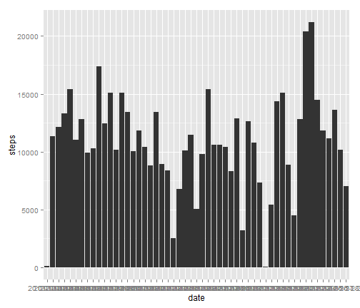
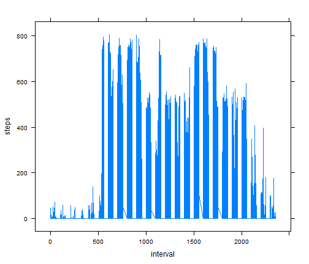
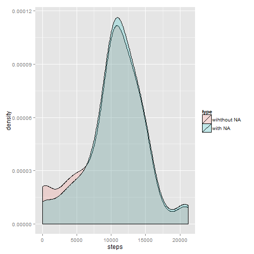
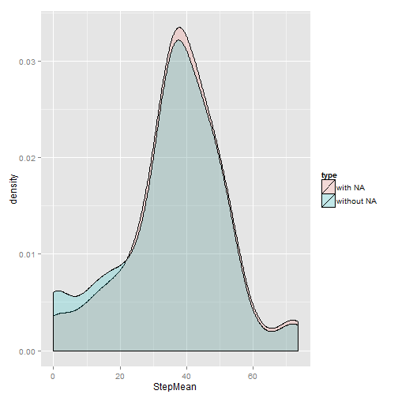
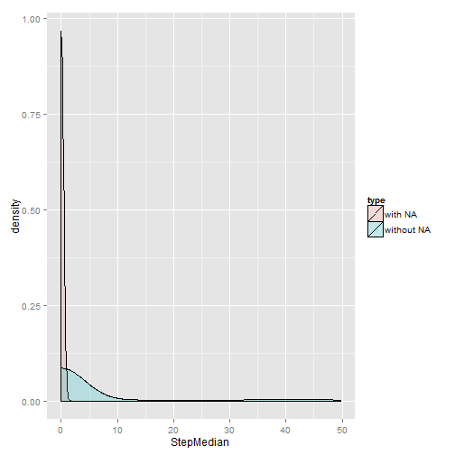
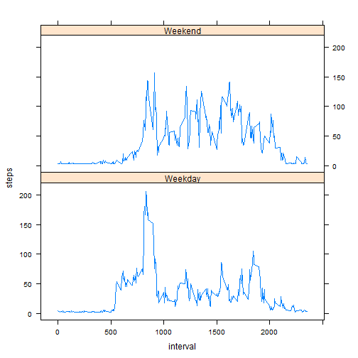

Reproducible Research - Assignment 1
========================================================

# Introduction

It is now possible to collect a large amount of data about personal movement using activity monitoring devices such as a Fitbit, Nike Fuelband, or Jawbone Up. These type of devices are part of the "quantified self" movement -- a group of enthusiasts who take measurements about themselves regularly to improve their health, to find patterns in their behavior, or because they are tech geeks. But these data remain under-utilized both because the raw data are hard to obtain and there is a lack of statistical methods and software for processing and interpreting the data.

This assignment makes use of data from a personal activity monitoring device. This device collects data at 5 minute intervals through out the day. The data consists of two months of data from an anonymous individual collected during the months of October and November, 2012 and include the number of steps taken in 5 minute intervals each day.
## Data
The data for this assignment can be downloaded from the course web site:

Dataset: Activity monitoring data [52K]
The variables included in this dataset are:

steps: Number of steps taking in a 5-minute interval (missing values are coded as NA)

date: The date on which the measurement was taken in YYYY-MM-DD format

interval: Identifier for the 5-minute interval in which measurement was taken

The dataset is stored in a comma-separated-value (CSV) file and there are a total of 17,568 observations in this dataset.

# Loading and preprocessing the data
  

```r
unzip("data/activity.zip",exdir="data")
```

```
## Warning: error 1 in extracting from zip file
```

```r
DF<-read.csv("data/activity.csv")
library("ggplot2", lib.loc="C:/Program Files/R/R-3.0.3/library")
library("lattice", lib.loc="C:/Program Files/R/R-3.0.3/library")
```
  What is mean total number of steps taken per day?
 Make a histogram of the total number of steps taken each day and plot it

```r
totalStep<-aggregate(. ~ date,data = DF,FUN=sum)
```
Plot the steps taken each day


```r
qplot(date,steps, data=totalStep, stat="summary", fun.y="sum", geom="bar")
```

 
 Calculate and report the mean and median total number of steps taken per day

```r
meanStep<-aggregate(steps ~ date,data = DF,FUN=mean)
colnames(meanStep)[2] <- 'StepMean'
medianStep<-aggregate(steps ~ date,data = DF,FUN=median)
colnames(medianStep)[2] <- 'StepMedian'
meanStep
```

```
##          date StepMean
## 1  2012-10-02   0.4375
## 2  2012-10-03  39.4167
## 3  2012-10-04  42.0694
## 4  2012-10-05  46.1597
## 5  2012-10-06  53.5417
## 6  2012-10-07  38.2465
## 7  2012-10-09  44.4826
## 8  2012-10-10  34.3750
## 9  2012-10-11  35.7778
## 10 2012-10-12  60.3542
## 11 2012-10-13  43.1458
## 12 2012-10-14  52.4236
## 13 2012-10-15  35.2049
## 14 2012-10-16  52.3750
## 15 2012-10-17  46.7083
## 16 2012-10-18  34.9167
## 17 2012-10-19  41.0729
## 18 2012-10-20  36.0938
## 19 2012-10-21  30.6285
## 20 2012-10-22  46.7361
## 21 2012-10-23  30.9653
## 22 2012-10-24  29.0104
## 23 2012-10-25   8.6528
## 24 2012-10-26  23.5347
## 25 2012-10-27  35.1354
## 26 2012-10-28  39.7847
## 27 2012-10-29  17.4236
## 28 2012-10-30  34.0938
## 29 2012-10-31  53.5208
## 30 2012-11-02  36.8056
## 31 2012-11-03  36.7049
## 32 2012-11-05  36.2465
## 33 2012-11-06  28.9375
## 34 2012-11-07  44.7326
## 35 2012-11-08  11.1771
## 36 2012-11-11  43.7778
## 37 2012-11-12  37.3785
## 38 2012-11-13  25.4722
## 39 2012-11-15   0.1424
## 40 2012-11-16  18.8924
## 41 2012-11-17  49.7882
## 42 2012-11-18  52.4653
## 43 2012-11-19  30.6979
## 44 2012-11-20  15.5278
## 45 2012-11-21  44.3993
## 46 2012-11-22  70.9271
## 47 2012-11-23  73.5903
## 48 2012-11-24  50.2708
## 49 2012-11-25  41.0903
## 50 2012-11-26  38.7569
## 51 2012-11-27  47.3819
## 52 2012-11-28  35.3576
## 53 2012-11-29  24.4688
```

```r
medianStep
```

```
##          date StepMedian
## 1  2012-10-02          0
## 2  2012-10-03          0
## 3  2012-10-04          0
## 4  2012-10-05          0
## 5  2012-10-06          0
## 6  2012-10-07          0
## 7  2012-10-09          0
## 8  2012-10-10          0
## 9  2012-10-11          0
## 10 2012-10-12          0
## 11 2012-10-13          0
## 12 2012-10-14          0
## 13 2012-10-15          0
## 14 2012-10-16          0
## 15 2012-10-17          0
## 16 2012-10-18          0
## 17 2012-10-19          0
## 18 2012-10-20          0
## 19 2012-10-21          0
## 20 2012-10-22          0
## 21 2012-10-23          0
## 22 2012-10-24          0
## 23 2012-10-25          0
## 24 2012-10-26          0
## 25 2012-10-27          0
## 26 2012-10-28          0
## 27 2012-10-29          0
## 28 2012-10-30          0
## 29 2012-10-31          0
## 30 2012-11-02          0
## 31 2012-11-03          0
## 32 2012-11-05          0
## 33 2012-11-06          0
## 34 2012-11-07          0
## 35 2012-11-08          0
## 36 2012-11-11          0
## 37 2012-11-12          0
## 38 2012-11-13          0
## 39 2012-11-15          0
## 40 2012-11-16          0
## 41 2012-11-17          0
## 42 2012-11-18          0
## 43 2012-11-19          0
## 44 2012-11-20          0
## 45 2012-11-21          0
## 46 2012-11-22          0
## 47 2012-11-23          0
## 48 2012-11-24          0
## 49 2012-11-25          0
## 50 2012-11-26          0
## 51 2012-11-27          0
## 52 2012-11-28          0
## 53 2012-11-29          0
```
# What is the average daily activity pattern?

Make a time series plot (i.e. type = "l") of the 5-minute interval (x-axis) and the average number of steps taken, averaged across all days (y-axis)

```r
AvgSteps<-aggregate(steps ~ date+interval,data = DF,FUN=mean)
```
 Plot the results:

```r
xyplot(steps~interval,data =AvgSteps , type="l")
```

 
 Which 5-minute interval, on average across all the days in the dataset, contains the maximum number of steps?


```r
AvgSteps[which.max(AvgSteps[,3]),]
```

```
##            date interval steps
## 4026 2012-11-27      615   806
```
# Imputing missing values

 Calculate and report the total number of missing values in the dataset (i.e. the total number of rows with NAs)

```r
sapply(DF, function(x) sum(is.na(x)))
```

```
##    steps     date interval 
##     2304        0        0
```

 Devise a strategy for filling in all of the missing values in the dataset. 
 The strategy does not need to be sophisticated. #
 For example, you could use the mean/median for that day, or the mean for that 5-minute interval, etc.
 I will replace null values with the mean of the day calculate before as integer
 Create a new dataset that is equal to the original dataset but with the missing data filled in
 The defined strategy is "Use day Avarage for filling the gaps"

```r
DF2<-DF
temp<-merge(DF2,meanStep)
DF2$steps[is.na(DF2$steps)]<-temp$StepMean[is.na(DF2$steps)]
```
 Some data elments are still NA, Assign zero is no mean is present

```r
DF2$steps[is.na(DF2$steps)]<-0
```
 Make a histogram of the total number of steps taken each day 

```r
totalStep2<-aggregate(. ~ date,data = DF2,FUN=sum)
totalStep$type <- 'with NA'
totalStep2$type <- 'wihthout NA'
totalStepToPlot <- rbind(totalStep, totalStep2)
qplot(date,steps, data=totalStep2, stat="summary", fun.y="sum", geom="bar")
```

 
Panel Plot comparing the two data sets

```r
ggplot(totalStepToPlot, aes(steps, fill = type)) + geom_density(alpha = 0.2)
```

 
## Report new Mean and Media
### This graph compare the old mean with the new mean


```r
meanStep2<-aggregate(steps ~ date,data = DF2,FUN=mean)
colnames(meanStep2)[2] <- 'StepMean'
meanStep$type <- 'with NA'
meanStep2$type <- 'without NA'
totalMeanToPlot <- rbind(meanStep, meanStep2)
ggplot(totalMeanToPlot, aes(StepMean, fill = type)) + geom_density(alpha = 0.2)
```

 

### This graph compare the old median with the new meadian

```r
medianStep2<-aggregate(steps ~ date,data = DF2,FUN=median)
colnames(medianStep2)[2] <- 'StepMedian'
medianStep$type <- 'with NA'
medianStep2$type <- 'without NA'
totalMedianToPlot <- rbind(medianStep, medianStep2)
ggplot(totalMedianToPlot, aes(StepMedian, fill = type)) + geom_density(alpha = 0.2)
```

 

The impact if missing values is the variation of the results, expecially of the median which is very much different


# Are there differences in activity patterns between weekdays and weekends?

This plot show the difference in activity between weekdays and weekend

Code for calculating the avg for type of day (Weekday or Weekend)

```r
DF2$Weekday<-weekdays(as.Date(DF2$date))
DF2$wend <- as.factor(ifelse(DF2$Weekday %in% c("Saturday","Sunday"), "Weekend", "Weekday"))
DF2Agg<-aggregate(steps ~ wend+interval,data = DF2,FUN=mean)
```

Plot of the results


```r
xyplot(steps~interval | wend,data =DF2Agg , type="l", layout=c(1,2))
```

 
